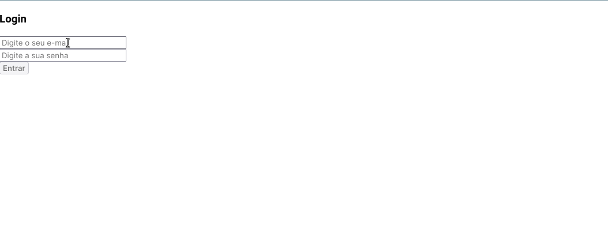
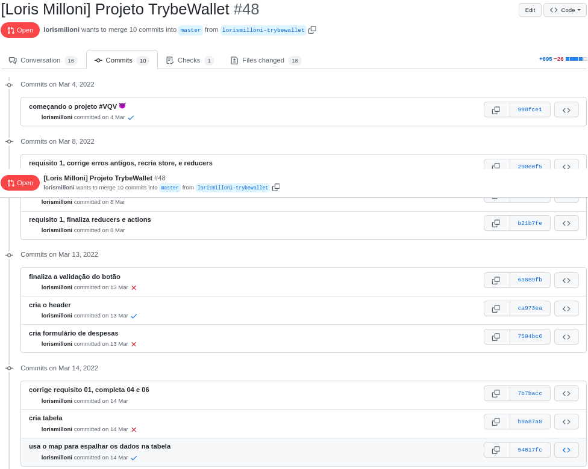
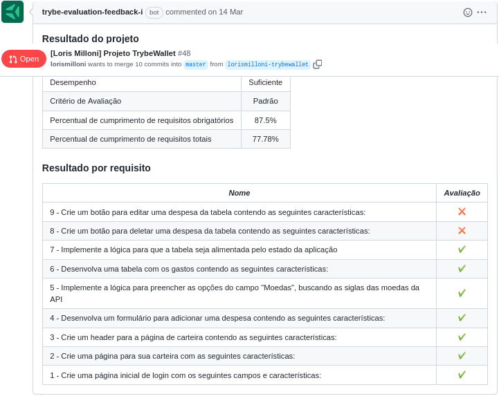

# studies-frontend-expense-wallet
Made in **14/03/2022**.

## This is my first website developed with Redux.
#### I developed a wallet expense to add expenses, view a table with the expenses and the total amount converted to a desired currency. Redux was used to connect a Store, use reducers, actions and async actions, dispatchers and to connect components.
   

#### Here is a gif from the application:

#### Trybe has a private repository with files that can't be shared. So here is my commit history print:

#### Here is the Trybe Evaluator

